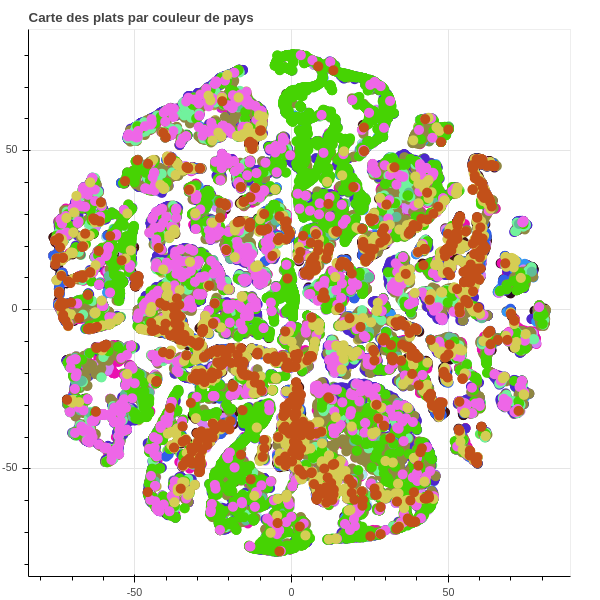
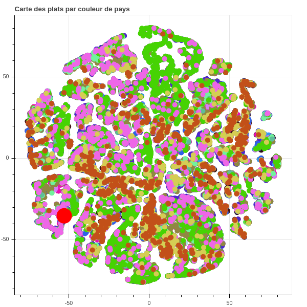

# What's cooking? - Code source

Ce projet est basé sur le défit [What's cooking?](https://www.kaggle.com/c/whats-cooking/) de Kaggle. Notre objectif était de pouvoir entrer une nouvelle recette de cuisine et obtenir son pays d'origine, tout en visualisant où elle se situe par rapport aux autres recettes.




## Installation et exécution du code

Pour tester le projet il suffit d'ouvrir le [fichier de démonstration](Soutenance.ipynb) avec Jupyter Notebook, tout en ayant [notre archive](whats-cooking-data.zip) dans le même répertoire. En cas de problème de dépendances/version il faut se connecter sur [Kaggle](https://www.kaggle.com/) et importer ces deux fichiers pour les lancer en ligne.  
Ensuite il suffit d'exécuter le Notebook et de réinventer le monde de la cuisine.

## Description des fichiers

### Code

La totalité de notre code final se trouve dans les fichiers de [soutenance](Soutenance.ipynb) et de [pré soutenance](pre-soutenance.ipynb).  
Pour fonctionner, le fichier de soutenance a besoin d'une [archive](whats-cooking-data.zip). Celle-ci contient tous les objets dont notre programme a besoin pour fonctionner. Vu que nous faisons de l'apprentissage et de la manipulation de données en masse, la création et la manipulation de ces objets prend beaucoup de temps et de ressources.

Nous avons donc décidé de créer un [deuxième Notebook](pre-soutenance.ipynb) dont le rôle est de créer tous ces objets. Ce Notebook est exécuté sur Kaggle, puis nous téléchargons ses fichiers résultats et nous les compressons afin d'obtenir notre archive.

### Données du projet

Kaggle met à notre disposition des fichiers d'apprentissage et de test.

[Les données d'apprentissage](train.json) sont dans un fichier JSON qui contient une liste de recettes avec pour chacune un ID, un type de cuisine et une liste d'ingrédients.

```json
[
  {
    "id": 1,
    "cuisine": "greek",
    "ingredients": [
      "romaine lettuce",
      "black olives"
    ]
  },
  {
    "id": 2,
    "cuisine": "southern_us",
    "ingredients": [
      "plain flour",
      "ground pepper"
    ]
  }
]
```

Pour [les données de test](test.json) c'est exactement la même chose mais sans le type de cuisine et avec des ID inconnus.

```json
[
  {
    "id": 101,
    "ingredients": [
      "baking powder",
      "eggs"
    ]
  },
  {
    "id": 102,
    "ingredients": [
      "sugar",
      "egg yolks"
    ]
  }
]
```

Enfin il y a un exemple de [fichier résultat](sample_submission.csv) au format CSV avec tous les ID de [test](test.json) sur *italian* (le type de cuisine le plus répandu dans nos données). Nous avons donc ajouté [notre fichier résultat](submission.csv) avec les réponses de notre code.

| id | cuisine |
| -- | ------- |
| 35 | italian |
| 17 | italian |

### GIT

Nous avons utilisé deux petits scripts shell pour faciliter l'utilisation de GIT.

Le [premier](s_git_Start.sh) ne fait qu'un ```git pull```

Le [deuxième](q_git_Stop.sh) fait un ```git pull```, demande le message de commit à l'utilisateur, puis ajoute et commit tous les fichiers avant de lancer un ```git push```
